# SWE 3313 Spring 2025 Project

`Revised Mar 24, 2025`

## Project Overview

This course has a large team project that starts immediately after Exam 1. You should start thinking about it now and considering who to add to your team.

The team project is 50% of your semester grade.

This project attempts to simulate the software development process a small team might follow to produce a software solution for a client (me). The project has seven graded components, one of which is graded by your teammates. The entire project is 50% of your semester grade (300 of 600 total points).

- [Team Selection](#team-selection)<br/>
  Not graded<br/>Due Wed Feb 12
  *Anyone not on a team by Wed Feb will be randomly assigned a team. There will be 7 teams of 4 and 1 team of 3 based on current class enrollment.*
  
  **Signup Sheet**
  https://docs.google.com/spreadsheets/d/1JLcnNRv2tydWXsNqBA9HR45NrC8d8V5oblN5siYydAI/edit?usp=sharing
- [Project Plan](#project-plan)<br/>
   15 points, 5% of total<br/>*Submitted via GitHub with Loom video*<br/>
   Due Wed Mar 5
- [Requirements](#requirements)<br/>
   30 points, 10% of total<br/>*Submitted via GitHub with Loom video*
   Due Fri Mar 28
- [User Interface Design](#user-interface-design)<br/>
   30 points, 10% of total<br/>*Submitted via GitHub with Loom video*<br/>
   Due Mon Apr 7
- [Technical Design](#technical-design)<br/>
   30 points, 10% of total<br/>*Submitted via GitHub with Loom video*<br/>
   Due Fri April 18
- [Implementation](#implementation)<br/>
   105 points, 35% of total<br/>*Submitted via GitHub with Loom video*<br/>
   Due Mon April 28 (with Final Presentation and Peer Evaluation)
- [Final Presentation](#final-presentation)<br/>
   60 points, 20% of total<br/>*Submitted via GitHub with Loom video*<br/>
   Due Mon April 28 (with Implementation and Peer Evaluation)<br/>
- [Peer Evaluation](#peer-evaluation)<br/>
   30 points, 10% of total<br/>
   
   *Submitted via D2L dropbox* 
   *(THIS IS THE ONLY D2L SUBMISSION FOR THE PROJECT)*
   Due Mon April 28 (with Implementation and Final Presentation) 

---

### This Document

*I am not trying to trick you anywhere in this document.* If something is missing, incorrect, or unclear, ask a question. If the document needs a correction or clarification, I will fix it. 

I update this document every semester... occasionally I miss something and the instructions are not quite aligned with the current semester. I apologize in advance for any mistakes, omissions, or clarity issues.

Always ask your Subject Matter Expert, Technical Lead, etc., when you are unclear. Stating "I did not understand" *after* the deadline is unacceptable. It is your responsibility to understand the project.

---

## What Will You Make?

Your customer (me) wants a web-based shopping cart/sales system that meets very specific architectural requirements. 

The system will manage no less than four related data tables... following are some basic examples to help you understand the domain (these are *not* complete, so do not copy this later on...):
- Inventory<br/>
   Each item in this table will be unique (you will not choose a quantity). Items have at least one related image, plus a description, and price. Each item has a unique ID that will never repeat. If you want to show multiple images, you must add another table to your design. For example:

   ```json
   [
   	{
       "ItemId": 1,
       "Name": "Boomerang",
       "Gender": "Male",
       "Breed": "Corgi Mix",
       "Description": "Boomerang is a friendly puppy who needs a home!",
       "PhotoUrl": "https://unsplash.com/photos/short-coated-brown-and-white-puppy-eoqnr8ikwFE"
       "AdoptionFee": 90.25
     }, 
     	{
       "ItemId": 2,
       "Name": "Pineapple",
       "Gender": "Female",
       "Breed": "King Charles Cavalier",
       "Description": "Pineapple is a friendly puppy who needs a home!",
         "PhotoUrl": "https://unsplash.com/photos/white-and-brown-long-coated-small-dog-wearing-pink-dress-P0A7SMIE8Cc",
       "AdoptionFee": 125.50
     },
     {
       "ItemId": 3,
       "Name": "Posey",
       "Gender": "Female",
       "Breed": "Alligator",
       "Description": "Posey looks menacing, but she is really just a cuddly sweetheart who wants to sleep in your child's bed!",
         "PhotoUrl": "https://unsplash.com/photos/crocodile-farm-kbmfkohn_7E",
       "AdoptionFee": 25.00
     }
   ]
   ```

   

- Users<br/>
   Users have a unique username and a role that sets their access level. Each user has a unique ID that will never repeat.
   - Customer: Can browse inventory and purchase items. Customers can self-register (create their own account).
   - Administrator: In addition to all Customer rights (except self-registration), Administrators can create, update, and remove *unsold* inventory, and run a sales report showing all sales.

   For example:

   ```json
   [
     {
       "UserId": 1,
       "Username": "jeff",
       "FirstName": "Jeff",
       "LastName": "Adkisson",
       "Password": "pancakes!",
       "IsAdministrator": true,
       "Address": {
         "Street": "666 Cheesecake Lane",
         "City": "Atlanta",
         "State": "GA",
         "Zip": "30015",
         "Phone": "8675309"
       }
     },
     {
       "UserId": 2,
       "Username": "max",
       "FirstName": "Max",
       "Adkisson": "Steele",
       "Password": "unhack-1ble-pw",
       "IsAdministrator": false,
       "Address": {
         "Street": "1313 Mockingbird Lane",
         "City": "Marietta",
         "State": "GA",
         "Zip": "30005",
         "Phone": "3142718"
       }
     }
   ]
   ```
   
   
   
- Sales<br/>
   A sale record groups the items a user purchased. A sale record also includes the date/time the item was sold and payment details such as sales tax, shipping fees, and the total. Once an inventory item is related to a sales record, it is no longer available for purchase. Each sale record has a unique ID that will never repeat.

   For example:

   ```json
   [
     {
       "SalesId": 19,
       "PurchasedByUserId": 2,
       "AdoptionDate": "2025-02-03 15:13:53",
       "SubTotal": 215.75,
       "Tax": 10.79,
       "Shipping": 0.00,
       "Total": 321.29
     }
   ]
   ```

- Sales Inventory Item

   A Sales Inventory Item is related to a Sales record. A Sales record must have 1 or more related Sales Inventory Items. A Sales Inventory Item represents the intersection of a Sale and one Inventory item. When an Inventory Item is related to a Sale, it is no longer available for further sale.

   For example:

   ```json
   [
     {
       "SalesId": 19,
       "ItemId": 1
     },
     {
       "SalesId": 19,
       "ItemId": 2
     }
   ]
   ```

Your team will decide what industry/product to target. You will pick something that sells *unique* items, similar to Etsy or a pet rescue. In other words, you will not create inventory items with a quantity greater than 1, so pick something that sells unique goods. Once an inventory item is in the Sales table, it is "sold" and no longer available for sale. Some ideas you might consider are:

- Artwork
- Pet Rescue (don't sell rescued pets - charge fees for adoption overhead and veterinary care)
- Automobiles
- Handmade Jewelry
- European Castles
- Pokemon (gotta catch 'em all)
- Video Game Items (players, gold, etc.)
- Asteroids (they are quite valuable, and each is very unique, for example, [Oumuamua](https://www.npr.org/2023/03/22/1164814086/scientists-think-they-know-why-interstellar-object-oumuamua-moved-so-strangely))

Each team will produce a sales system tailored to your selected product/industry implemented using my architectural requirements. This is like each team making a car with four wheels and two doors and an engine, but every car is uniquely styled, has a different color, is electric or gas, etc. Every team's "car" will be unique in this way, but share the architectural characteristics I specify.

Be creative (engineering is a very creative profession) and put some thought into this. Pick something that will make a great looking presentation and keep your teammates, classmates, and me interested. Produce something that you will be proud to show a future client/employer when they ask you for an example of your work.

---

## What Will You Need?

This project covers many disciplines and you will use a variety of tools. Fortunately, none of them will cost you anything.

1. Teammates<br/>
   Far and away the most important bit.
2. A Team Name<br/>
   Completely unnecessary, but you cannot have a team without a name. Pick something you like - it does not have to be boring.
3. A free Github account<br/>
   You will check in your project work to a GitHub repository. Your team can either create a dedicated Github account or choose one team member to house the team's work in their  account. If you are unfamiliar with source control, you will get familiar with it this semester. It is an essential software engineering skill. You should also consider trying a git client for handling cloning and checkins, such as Github Desktop or the free version of GitKraken (my personal favorite).
4. An IDE for development<br/>
   
   I recommend getting a JetBrains education license (free) using using a JetBrains IDE. JetBrains has IDEs for every major language and operating system. You can use something else for development, but I recommend these, particularly if you have never used a professional-grade tool. JetBrains IDEs work on Windows, MacOS, and Linux. Do not use a text editor such as Notepad. Learn how to use an IDE including the built-in debugger.
5. A free YouTrack account<br/>Your project plan will use YouTrack's excellent [Gantt Chart creator](https://www.jetbrains.com/youtrack/features/gantt_chart.html). YouTrack is free for up to teams of 10. Each team needs one YouTrack account for making your project plan. https://www.jetbrains.com/youtrack/
6. A free Marvel account<br/>
   Your UI design will be made in Marvel, a friendly high-fidelity design tool. https://marvelapp.com/signup
7. Software to record video presentations<br/>
   Each of your project submissions will include a Loom video. Loom makes screen recording very easy. Create a free Loom account. You can make videos up to 5 minutes long with Loom. Signup for the free Starter plan. https://www.loom.com/pricing
9. Diagramming tools<br/>
   I will introduce you to a few. I am partial to [PlantUML](https://www.plantuml.com/plantuml/umla/jSxBQW8n6CNnVPxYuAPGK9pBgeYuQJTz28cJKoSqbo7vh1NjktTguw98SL6w2l_am2-hB3h9pZjrXzuQGdeY3r4ktTdKEQenzLkq1aEA6qUViRVIGuUjeq6NuZxZXHILNsqOTD8UpWRAOI1YaZugnI1M3fWydizvDO7EuBp2KG7thDRMu05XvpTCM2os34nQQ9PB1KodNwEWFSUDy5t6DCnTieFO62wN7rTCNPYwCFLjvlelJy_droWzqzfGj7NvTx8fP5F8vZRvHx4jObl4zX_4UONJQJQBnz6flpEMR7vcgrOCPkVT9m00) and [Mermaid]((https://mermaid.live/edit#pako:eNp1Uk1vwjAM_StWdtkk-AHtreJDmhgFFdhh6w5ea9qINqmcsIkB_30p7bSVjlziOM_2e7aPItEpCV8QjyVmjGWswJ1REMHpNBzqI4TBfDIejqPH50kEPmBR6E_zizo2Zn2MZakyYMqkM9FKrcJ9-U4My1kPVeKO-k5Hprj2vr5BhWzbmufmWk6i1SK8wVGaDqhPMWX5QWyeZELKkKMHsVjnBEXruIvFdcy95z3AVrKxIZbk8AtVHMDzIMmRMbEuHSBT0x9K-wmgwCa291HlWhFs_vRIKguYUUdxR2NfUoIc_df4AUxnN_Rf5CfUAbXF5kG4mQaj9SZyxXSttKZoNXwRa9DsJuW01vP3L5M0YiBK4hJl6pbpwi4WNienVvjOTJF3dUvODod7q1cHlQjf8p4GYl-laKldP-FvsTDOW6F60frnff4G-kLSMQ)) because I dislike drawing using point/click/drag. You can also use Dia (I think it stinks, but it is free and cross-platform and many courses here require it) or any professional grade diagramming tool such as LucidChart, yEd, etc, You *cannot* use PowerPoint (which is not a professional grade diagramming tool) or hand drawn diagrams. I prefer yEd to Dia if you like click/drag drawing. https://www.yworks.com/products/yed Try a few and pick the one you like.

---

## I Just Finished FYE. I am REALLY Nervous. Can I Do This?

Yes!

Some of you are not confident in your abilities yet. This course and this project will help you build the confidence you need to succeed in this profession.

I will help you get there. You will surprise yourself this semester. I hear it every time I teach 3313. 

This field requires a lifetime of learning new things. If you come out of here with one thing, it's the confidence that you can learn new things and apply what you have learned to the latest problem you have to solve.

Google and YouTube are your friends. Computer science has never been more accessible than it is today thanks to the massive number of training videos, blogs, and examples you can find online.

You have probably noticed I stay after class every night. You will find that I am almost always available at that time. Take advantage of that if you and your team are struggling. 

Most importantly, do not wait until the last minute to ask for help and manage your time well.

------

## After Each Component Is Graded

After each part of the project except the Final Presentation, I will pick an outstanding submission and share that team's presentation with the class.

I encourage you to watch these shared presentations. We have much to learn from one another.

------

## Crashing and Burning on One Part

Almost every semester I see an outstanding team deliver a bad component, even getting a D or F on that part. Most of these teams go on to make excellent grades on the overall project.

Why does this happen? This project covers multiple disciplines - writing, design, coding, presenting, etc. It is hard to do all of them well unless everyone is contributing their combined expertise.

Also, team members let you down sometimes, even in excellent teams. Sometimes people just get overwhelmed or have problems in their personal life that temporarily crush their ability to execute. Your team has to manage this. All of you must have the attitude that you succeed or fail together. Support one another. Learn from failure to avoid failing again.

Whatever the reason, if your team fails on one piece, do not let it demoralize you. There are many pieces in this project and a single bad grade will not hurt your team overly much. I know grades are important, but in the long run, learning from failure is even more valuable.

---

## Problems with a Team Member

Sometimes a team has a member that does not do their part.

This is, unfortunately, a realistic situation. It happens in professional practice as well. It is taxing for leaders and team members alike. It will try your patience and demonstrate to you how difficult it can be to lead a complex project.

If you have serious problems with a team member, talk to me AFTER you try to manage the situation. Diplomatically explain your concerns and try to find some common ground. Do this in person - not over something less personal like texting or email. Do not criticize. Stick to the facts. Also do not make it 3 on 1 so the person you are speaking with does not feel threatened. Sometimes a personal chat is all that is needed.

One thing I encourage you to do is *never* let someone else drag your grade down. I have known students who took a bad team score because they did not want to see a lackluster team member get a good grade as a result of their hard work. I understand your frustration, but ultimately it is not the grade that matters - it is your experience and capability. Before you let your project suffer because you do not want to carry someone who is not performing appropriately, remember that they may benefit in the short term from your hard work, but in the long run only you will succeed. 

Also remember that you will do peer review at the end of the project and it is 10% of the project grade, so underperforming team members will not get the same grade as everyone else on the team.

No matter what you do, make sure this is never a popularity contest. Keep this about the work.

--------

# SWE 3313 Project Components

- [Team Selection](#team-selection)
- [Project Plan](#project-plan)
- [Requirements](#requirements)
- [User Interface Design](#user-interface-design)
- [Technical Design](#technical-design)
- [Implementation](#implementation)
- [Final Presentation](#final-presentation)
- [Peer Evaluation](#peer-evaluation)

---

## Team Selection

*Anyone not on a team by the deadline will be randomly assigned to a team.* 

This course contains up to 40 students. All teams will contain 4 students unless the course has an irregular count (40 % 4 != 0). In that case, there will either be one or two teams of 3 as well.

If a teammate drops after midterm, your team will remain the same. It's unusual (though it has happened) that more than 1 teammate drops at midterm. We will handle these cases if and when they occur.

Teams of 3 do not receive any grading leniency. There are fewer people to coordinate (often the teams of 3 do better as a result). 

If there is a team of 2 due to a student on a team of 3 dropping the course, I will discuss with the remaining team members on how to complete the project.

#### Team Signup Sheet 

The link is posted in the [Project Overview](#project-overview) in the Team Selection section.

#### Choosing Teammates

Choose your teammates wisely. I recommend thinking about the various competencies necessary to perform each component of the project with high quality. Each of you needs to contribute to each piece, so do not let your teammates do the work simply because they might have a bit more skill in a particular area. In fact, you should probably participate *more* in pieces where you have less expertise to get the practice you need to improve. Here are some of the competencies necessary to execute the various phases of the project.

- Leadership<br/>
   Someone needs to coordinate the team. Some teams do fine without this, but they are the exception. Most teams need someone who coordinates the group's activities and occasionally has to push one or more people to do their part. This can be a thankless job. I recommend learning a bit about [Servant Leadership](https://www.forbes.com/sites/forbescoachescouncil/2020/03/11/traditional-leadership-vs-servant-leadership/?sh=493498c6451e).
- Written Communication<br/>
   This project has several large written deliverables. Your components must be professional-grade and exhibit outstanding grammar. Your work must effectively communicate very complex ideas. This includes the [Project Plan](#project-plan), [Requirements](#requirements), and [Technical Design](#technical-design).
- Visual Design<br/>
   This project has a significant user interface design effort. This includes the User Interface Design component. Being a good visual designer means being able to see the world through the eyes and experience of your target audience.
- Technical Design<br/>
   Every phase of this project requires you to understand what you can (and cannot) produce within the timeframe. You have requirements from me to execute. This is not simply expertise in coding... this involves deciding how to build something that meets the requirement with high quality in the allotted timeframe. 
- Implementation / Coding / Packaging<br/>
   There is one coding phase. Being a good coder is not enough to ace this part. You have to execute the requirements, technical design, and visual design. In other words, you have to convert the artifacts produced earlier in the project into a working system.
- Presentation<br/>
   Every component (Project Plan, Requirements, etc.) includes a video presentation. This is where you will take the finished work you are delivering and produce a short 5 minute video describing what was done. This is where you are convincing your customer (me) that the work you are doing is high quality, meets or exceeds expectations, and that I can be confident you are on the right path.

### I Do Not Know Anyone... I Never Get Picked for Teams... I Have Social Anxiety... It is Feb 11 and I am NOT on a Team... 

None of this is a problem.

Anyone not on a team by selection day will be assigned to one by me. If you are have difficulty finding teammates regardless of the reason, it will work out fine.

### Example Team Selection Spreadsheet

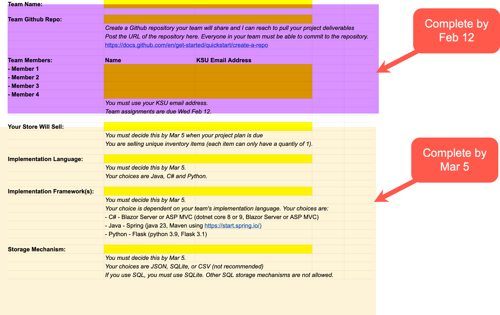

### Instructions and Grading Rubric

[Team Selection Instructions and Grading Rubric](details-team-selection.md)

-----

## Project Plan

`5%, 15 of 300  points`

This component has numerous parts:

- Introduction
- Team Resumes and Team Assignments
- Technology Selection
- Generating a Project Plan and Gantt chart in YouTrack
- Producing a 3-5 minute video presentation of your project plan

### Technology Selection

After Requirements Elicitation, each team will decide and report to me the following:

- What language you will use to build your system
   Your choices are limited to Java, C#, and Python.
- What web framework you will use to create the screens for your system
   You can choose from:
   - C# - Blazor Server or ASP MVC (dotnet core 8 or 9, Blazor Server or ASP MVC)
      *If you are unsure what to choose, I recommend selecting C# and Blazor Server. Many teams have done outstanding projects with these selections over the years.*
   - Python - Flask (python 3.9, Flask 3.1)
   - Java - Spring (Java 23, Maven using https://start.spring.io/)
      *Generally, students find this more challenging than the C# and Python choices, even if they learned some Java in FYE. It is powerful, but a bit unforgiving. Java web development takes a bit more effort to properly setup.*

Some things to consider when choosing:

- Everyone on your team must agree. 
- Do not select something outside of your ability to deliver. If you pick something with a large learning effort, be prepared to make time for that. Remember - it's critical to ship working software... it's less critical (in this case) to write it on the coolest, latest, greatest thing.
- Do your research. You might even consider looking at job boards such as Indeed to see what has good economic value to you and your teammates for future career opportunities.
- Read the [User Interface Design](#user-interface-design) section of the project, then ask yourself "can I build a good looking application that matches my UI design with the language/framework I am selecting?" Your UI Design helps your client understand how the final implementation will look. Do not pick something that will look awful compared to your UI design.

If you are thinking "I want to use *some other thing*", the answer is no. These are your choices. Often (in a real job or client engagement) your team lead or client will tell you what language and frameworks you must use and you have to learn them. They might want you to use something their other teams already know and support. 

**IMPORTANT NOTE:** Start thinking about *how* your system will retrieve and store data. Your choices include JSON, SQLite, and CSV. Your data must be written storage - it will not only live in memory - and be available after restarting the application. You do not have to select this mechanism until [Technical Design](#technical-design), but you need to start thinking about it and doing some research. Many of the frameworks I listed include libraries to help with this requirement. I always give an *optional* JSON lecture for those of you who want to use this valuable technique. If you choose SQL, you *must* use SQLite](https://www.sqlite.org/index.html). 

Note that I do *not* recommend using CSV for storage... I have seen *very few* successful projects that use CSV over the years. I allow it because some FYE instructors cover the format, but it typically is quite awful (plus JSON or SQL are far better for projects like this).

#### Technology Description

Now that you have your technology plan, you will produce a Markdown document that you will post in your team Github repo that describes what you selected and (briefly) WHY you selected. I will be looking for what languages, frameworks, and data storage plan you are selecting. Links to the sites that describe the technologies are always useful as well. You also need to list the operating system and other requirements necessary to use your software.

1.  Language
2.  Framework
3.  Storage plan
4.  Operating environment
5.  Any other software necessary to build and use your implementation

### Creating Your Project Plan in YouTrack

You will use YouTrack to develop your project plan. This will include the milestones and various tasks to execute. This will be presented in Gantt chart format using YouTrack's Gantt chart creator. 

You will use the project deadlines in the course calendar (see the Syllabus) as your milestone dates.

You will decompose the milestones into into epics and stories, assign each a priority and team member(s), and order them in a Gantt chart.

Here is an example Gantt chart drawn in YouTrack:

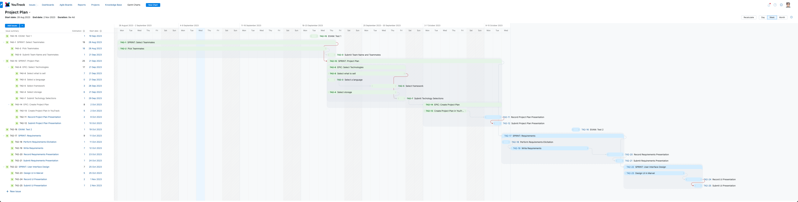

[DIRECT LINK TO FULL SIZE IMAGE](https://raw.githubusercontent.com/jeff-adkisson/swe-3313-fall-2023/main/project/README.assets/project-plan-screenshot.png)

Gantt chart components you will use:

-  **Milestone** - Represents something you are delivering. See the course calendar's project deadlines. For example, "Project Plan". Your Milestone should be short and does not require a verb. Your milestones are:
   -  Project Plan
   -  Requirements
   -  User Interface Design
   -  Technical Design
   -  Implementation
   -  Final Presentation

-  **Epic** - Represents a grouping of stories. For example, "Produce video presentation". Every epic must contain a verb. Epics sit under milestones.
-  **Story** - The lowest level of detail needed in this project plan. For example, "Script and record video presentation" and "Post video presentation to team Github repo". Every story needs a verb. Stories sit under epics.

#### Association Lines

Your epics and stories will logically show the start and finish dates for each epic and story. You will connect each milestone to the next milestone with a single association line like you see represented  the example Gantt chart above.

Do not show everything starting and finishing on the same day. That will not get you a good score. Really consider what has to be done, break down the tasks, and put them in the proper order. You are <u>*estimating*</u> the effort. You do not need to assign people to these entries. A top score on this part of the project will show me a project plan I can understand and hopefully see that you have carefully considered how each piece fits together.

#### Content in each Milestone / Epic / Story YouTrack Entry

You do not need to write anything additional in the entries for each item you put in YouTrack issue tracker. All that is necessary (though you can do more) is the name, association, and start/end dates.

#### Notes

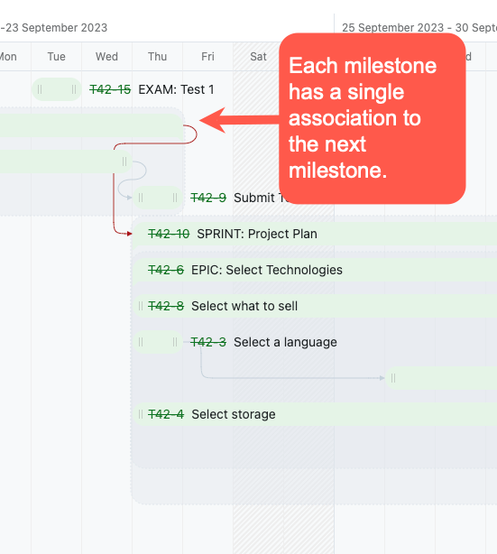

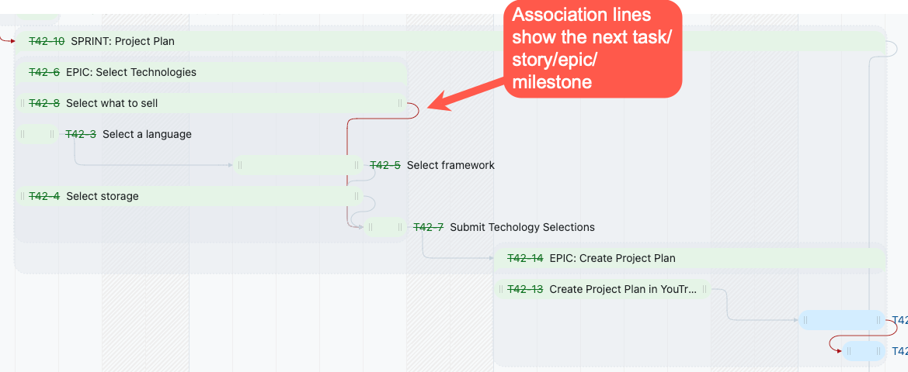

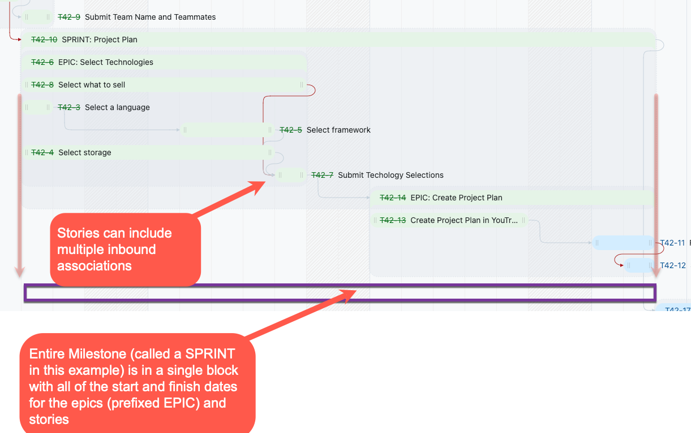

#### Documentation for YouTrack Gantt Charts

https://www.jetbrains.com/help/youtrack/server/Gantt-Chart.html#gantt-chart-example

https://www.youtube.com/live/jXBo-RasY3g?si=DOLYqb86P2J8mhCs&t=1566

### Team Resumes

Each member of your team needs a *one page* resume written in Markdown (*not a linked PDF or Word document*) describing:

-  Your technical capabilities - languages, software, etc. Do not list things like Microsoft Office or Google Docs. Keep it interesting. 
-  Your technical experience. If you do not have any internship credits or professional work, list things like Hackathon or Game Day participation. If you have none of that, list the classes you have taken that contribute to your CS or SWE degree.
-  Your name and KSU email address. Do not list any personal contact information.
-  Links to anything relevant such as a Github repo, StackOverflow reputation page, LinkedIn, etc.

Resume Format:

-  All resumes will be written in Markdown (not PDF or Word or TXT) and posted in your team Github repo. 
-  All resumes will use the same format.
-  All resumes must be spell checked and use proper grammar. 
-  Choose something professional for all of your resumes. [Here's a resource to consider (and there are many more, so do your research).](https://workwithcarolyn.com/blog/digital-cv-guide)

### Team Assignments

Here you will list the primary duties of each member of your team along with links to their resumes.

For example:

-  Jeff Adkisson [link to resume]
   *Jeff is the project leader. Additionally, Jeff will support the coding effort and will record all of the presentations except the Final Presentation.*

Note that team assignments CAN AND WILL change. All you are doing here is trying to figure out the roles each of you want to perform. By the end of the project, it's likely these roles will differ from what you plan here.

Remember that everyone must contribute and you need to try to distribute the effort as evenly as possible.

### Video Presentation

Your recorded presentation will present your plan within 5 minutes. I want you to think of every presentation in this project as a mechanism to build confidence in your client that the project is heading toward success, demonstrate technical proficiency, and help your client understand the decisions your team is making. Your client (me) wants reassurance your team is on the right path. I recommend putting some thought into your presentations. You will do this for real customers in your career, so do not write this off as just something to appease your professor. Carefully organize your presentations. I do not recommend submitting the first one you produce any more than you would submit the first draft of an essay as a final report.

You will check the link to your video presentation and a link to your YouTrack Gantt chart plan into your team's Github repository. 

Since every team will have the same milestone dates, most of these will look similar at the macro level, but will vary significantly in the task breakdown. That is fine... there are many ways to perform this project.

Your 3 to 5 minute presentation will be a screen recording with audio including:

-  A very short introduction to your team.
-  The technologies you plan to use and briefly explain why you chose them.
-  A visual review of your project plan. 
-  During your presentation, call out any risks you see. There is risk, so do not forget to do this. Learning to spot and manage risk early is essential to this course.

Make sure your audio is clear and free of background noise. The presentation is an audio/screen recording of your screen showing your Github material and project plan. You do not need a face recorded in the video.

### Written Introduction

Your team Github repo will have a README in the root in the repo that includes the following:

-  A short introduction to the project and what you plan to produce. For example:
   Welcome to the project repository for **Jeff's Super Team of Himself!*. Here you will find all of the artifacts, presentations, documentation, and source code for our SWE  3313 class project.

   We will create a small e-commerce website using Svelte and Express along with PostgresSQL to sell one-of-a-kind vintage motorcycles. 

-  **Meet Our Team**
   Put links to each of your teammates' Markdown resume files.

-  **Team Assignments**
   Link to your team assignments Markdown file.

-  **Technology Selection**
   Link to your technology selection writeup Markdown file.

-  **Project Plan**
   Link to your YouTrack Gantt chart.

-  **Project Plan Video Presentation**
   Link to your project plan's video presentation checked into your team repo.

[Your written introduction should use good Markdown structure for headers, links, etc.](https://www.markdownguide.org/basic-syntax/) I like writing Markdown in [Typora](https://typora.io/). It has spell checking and other nice features. It has a free trial (I paid for mine - it's worth it). You can find many other free Markdown editors for your system or just write Markdown in [VS Code](https://code.visualstudio.com/docs/languages/markdown) or your IDE. Markdown is very accessible and does not require any fancy software.

### Team Github Repo

I will be using the GitHub repo link in the project spreadsheet to reach your team's work. EVERYTHING in this project except what is hosted in YouTrack will be checked into your team Github repo.

### Granting Jeff Access to YouTrack

Each team will send Jeff a YouTrack account. Email me at JAdkiss1@Kennesaw.edu. I need this so I can review your YouTrack Gantt chart.

### Example Markdown `README.md` From a Prior Semester

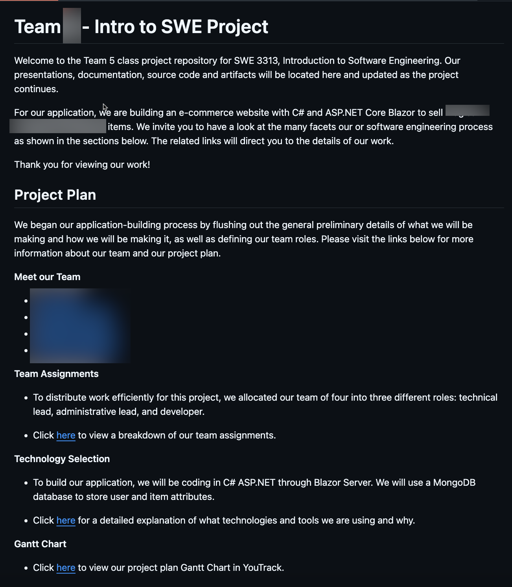

### Why Is The Project Plan Only 5% of the Grade?

1. This is your first submission and I will grade it rigorously. You will see my expectations without losing a lot of points on the project. I expect excellent spelling and grammar, well-organized work, and a polished presentation. Over and over I will stress that you need to perform as if you were being paid by a customer to do this work - not just getting a grade in a core class.
2. This part is easy relative to the rest of the project (it has a lot of little pieces, but none are technically challenging). I give you the dates and milestones and you will back into a project plan and Gantt chart. If you were creating a real plan from scratch, it would be a much larger effort trying to figure out how long things actually take.

### Submission and Grading Rubric

[Project Plan Submission and Grading Rubric](details-project-plan.md)

-----

## Requirements

`10%, 30 of 300 points`

This component has five sections:

- Requirements Analysis and Elicitation
- Short Introduction with links to Requirements, Use Case Diagram, Decision Table, and Presentation
- Requirements Writing
- Use Case Diagram
- Decision Table
- Presentation

### Requirements Analysis and Elicitation

Your customer produced some notes you must read very carefully.

After reading the customer's notes (paying carefully attention to what you think the customer MUST HAVE, NEEDS TO HAVE, or WANTS TO HAVE) hold an elicitation session with the customer to ask detailed questions.

Take detailed notes during the requirements elicitation. Your customer is not going to be available 24/7.

Note that there is more work than can be done in Version 1 of your implementation in the customer's notes. Your responsibility for Version 1 is to implement all of the MUST HAVE requirements. You will document the other requirements in Version 2.

### Customer Notes for Requirements Elicitation

It's a pleasure to work with your engineering team to help my company sell ______( *whatever your team is selling* )__. 

The new application must do a few things very well. There are some other things I need or want, but those may not make it into this first version. As you read this, I am sure you will be able to tell rapidly what I simply cannot do business without in the first version. Ask if you are not sure. 

Users must be able to self-register (create their own account) and login. I also must have a more powerful "admin" user type that can login and run sales reports. Obviously admins cannot self register. All users must have a unique username and 6-character (minimum) password. To make an admin, someone who is already an admin needs to be able to transform a previously registered user into an admin. It would be great if there was a simple user interface to do that, but I need some process regardless if a user interface is too much work for Version 1.

After a user logs in (or registers), the user must see a list of all *available* inventory sorted by highest price to lowest price. This is the "main" screen. They cannot see anything that is already sold. The inventory must have a short name, picture, price, and brief description, plus a button to add the item to a shopping cart. Obviously the user can add multiple items to the cart. All items must have at least one picture. I'd love it if we could do multiple pictures, but I heard that might be hard in this first release, so I can live with that in the future if necessary.

The user should also be able to search the inventory by typing in a search box. The system will try to match the words in the box to either the item's name or description.

An item for sale might look like this:

-  Name: 2016 Suzuki GSXS 1000 Motorcycle
-  Picture: At least one photo
-  Price: $10,000.00
-  Description: Super clean, low mileage liter bike. Great performance, sporty look, and loaded with cool aftermarket toys.

All of the prices are in US dollars and must be formatted with a $ sign and commas and decimal points. Note that a programmer friend wanted me to tell you that you must store prices in a decimal/currency format that is base-10 - not a floating point. I have no idea what that means, but he was quite adamant that I pass that factoid along.

When a user decides to pay, they must click a Checkout button to start the payment process. That looks like this:

1.  The user cannot click Checkout if the shopping cart is empty.
2.  After clicking Checkout, the user must see a list of everything in the cart and a subtotal cost in US dollars. From this list, the user can remove items from the cart. If the user removes everything from the cart, take the user back to the main screen automatically.
3.  From the shopping cart page, the user must click Pay Now to start the payment process. They also can return to shopping.
4.  When Pay Now is clicked, the user must enter their shipping address, credit card number, phone number, and shipping speed. All fields are required. The credit card also requires the expiration month and year and the CVV security code.
5.  Shipping speed options include: 
    -  Overnight: $29
    -  3-Day: $19
    -  Ground: $0, free
6.  After all of the fields are complete, the user must click Confirm Order.
7.  On the Confirm Order page, you must show a list of what the user is buying (name and price only), the subtotal, tax (6% of the subtotal) shipping speed cost, and grand total. For example, if there are 3 items in the cart and all three cost a total of $325 and overnight shipping is selected, the grand total will be 325 + (325*.06) + 29 = $373.50.
8.  To complete the transaction, the user can click Complete Order. This will take the items out of inventory and show the user's receipt. The user can also back up to the Checkout page or return to the main page. If they do not complete the order, leave whatever they have in the cart in case they check out later.
9.  Once the user clicks Complete Order, you must show a receipt. It looks a lot like the Confirm Order page, but also must include the last four digits of the user's credit card number and their shipping address.
10.  I also want receipts to be automatically emailed to the user, so whatever you show on the screen I'd also like that emailed to the user for their records.
     *Note: Your "email" is just displaying your customer's receipt in the browser. You do not have to actually send an email (unless you want to - get a free SendGrid account if you want to send emails).*
11.  Finally, the user will click OK to exit the receipt. Note that the user cannot return to the checkout at this point because the cart is empty.
12.  When the user returns to the main page, the inventory the user just bought must be gone - they cannot see it in the list or in the search page. At this point, whatever the user bought must be visible in the sales report.

That sums up the user purchase experience.

Administrators have a few more "powers".

1.  An administrator must be able to run a sales report that shows everything purchased and who purchased it. I would LOVE it I could click on a sold item and it shows me the receipt related to that.
2.  An administrator needs to be able to export the sales report to CSV. This will let the admin analyze the data better in something like Excel.
3.  Finally, administrators must have some way to add inventory into the system. How will they add new inventory to the database? They need some approach. I would love it if they could open a page and enter the information (and choose a picture) and it gets added to the database. If that is too hard, they could just enter it into the database manually. Initially something or the store will be empty. My admins are not overly technical, but they could enter the information into a file or database screen if you show them how and write down the steps. 

One last thing... I'm really worried how all of this is going to look, so I *must* have a high-fidelity mockup created of the screens and application flow before coding starts. I want to see how it's going to look when you finish it. I cannot really envision how things look when people just hand me a bunch of requirements, so I need you to show me what I can expect what it is all done.

### Requirements Writing

The project is multiple versions, but we are only implementing Version 1. You will write the requirements for *all versions* and organize your material like this:

-  Version #
   -  Epic Name and unique ID (write these like a use case bubble - very brief, but specific enough to be clear what we are doing)
      I suggest something like T (for team) and # and E and a number for your epic id. For example, T9E-2.
      -  Story Name and unique ID (name should also have subject and a verb, but shorter than description).
         I suggest something like T (for team) and # and S and a number for your story ID. For example, T9S-12.
         -  Priority (Must Have, Needs to Have, Wants to Have)
         -  Estimated Effort (no less than 1/4 day, no greater than 5 days)
         -  Functional or Non-Functional (choose one)
         -  Story description (must have a subject and a verb and be long enough to prevent ambiguity)

Your requirements will be detailed, precise, grammatically correct and correctly spelled, and well-organized. Your requirements will strive to be complete and have no errors of omission (missing requirements) or errors of inclusion (unnecessarily adding to the scope of the project). Each requirement will be assigned a priority, an estimate of effort (no more than 5 days, no less than .25 days), and whether it is functional or non-functional.

After reading the customer's notes, you will note the customer mentions a lot of screens or pages. These hint how your application will be organized and data flows through the system. Sometimes you might find that a single screen is a full size epic with many stories under it or a screen is quick to make and is a single story,. Note the screens carefully when working out your requirements. Also carefully note data format items, such as currency. 

In addition to what the customer wrote, you bring your own experience using software to this. The customer has left many things unsaid, but the expectation is there. For example, the customer expects it will be easy to use and navigation is friendly with lots of ways to move forward, back, and cancel. You need to think about this and really decide how to make a friendly app. If it's not friendly, it will not sell the inventory... users will just go to another online store that is easier to use.

Your requirements MUST be properly written. Review the requirements lecture how to write good stories. In particular, well-written requirements have some or all of the following:

-  A subject and a verb (always)
-  Who is performing an action, such as "The user must..." or "The system must produce a CSV report..."
-  Enough information to avoid ambiguity, but not overly long.
-  Examples of calculations, such as how to compute a total.

Well-written requirements are not too large or too small. If you find the estimated effort is really large, ask if it is really properly decomposed into a reasonably sized story.

Keep your functional requirements free of technical language. The functional requirements should therefore be customer-friendly and using language the customer will understand. I personally believe non-functional requirements are often technical in nature, so you can use light technical language there. That said, the correct plan for deeply technical work is in your technical design, so even the non-functional requirements should not be filled with highly technical work.

NEVER forget that your requirements must speak to the audience consuming the requirements. Your stakeholders and implementation team must be able to read and understand the material. So always write with your audience in mind and focus on what they need to know. I will remind you of the timeless words of [William Struck Jr from Elements of Style](https://daoyuan14.github.io/elos.pdf):

```
Vigorous writing is concise. A sentence should contain no unnecessary words, 
a paragraph no unnecessary sentences, for the same reason that a drawing should 
have no unnecessary lines and a machine no unnecessary parts. This requires not 
that the writer make all his sentences short, or that he avoid all detail and 
treat his subjects only in outline, but that every word tell.
```

Get everything written and let it sit for a day. Next, re-read it slowly. *Edit your work.* Good writing takes more than one pass. You are looking for issues such as problems with internal consistency, clumsy or confusing material, errors of omission or inclusion, missing data, and poor organization. Often after I re-read my material I move material around to flow more logically. Do not hesitate to delete poor material and edit it for brevity. [Stephen King calls this "killing your darlings" in On Writing.](https://www.susangabriel.com/writers-and-writing/stephen-king-on-writing)

**The best engineers are great communicators. Strive to be a great communicator.**

### Use Case Diagram

You will produce one use case diagram and link it to your submission. The diagram will be a professional-grade graphic in your Github repo that shows the epics in your project. Do not make the use case diagram into a process flow. 

Show all actors, such as users, administrators, banks, etc. and their relationship(s) to the use case bubbles.

Make your use case diagram show all of the epics in your requirements for all versions - not just Version 1.

You can draw your diagram in any graphical tool except PowerPoint (which is awful for this). I recommend [PlantUML](https://plantuml.com/use-case-diagram), [Dia](http://dia-installer.de/), or [YEd](https://www.yworks.com/products/yed). All of these are free, open-source, and cross platform. Note that I like Dia the least, but a lot of other classes here use it. PlantUML is my favorite because it doesn't require drawing - you write the diagram as simple code and it draws it (awesome!).

However you make your diagram, you will add the graphic to your markdown and display it in your markdown work. The diagram must be in your Github repo and linked to your markdown.

Your diagram must have actors, association lines, a bounding box, and all use case bubbles. Do *not* use extends or includes relationships and once again, this is *not* a process flow.

When you are done with the Use Case Diagram, ask yourself it it would help facilitate a good conversation about the high-level functions of your software solution and the actor involved in using the system. If not, revise it.

### Decision Table

You will produce a decision table showing the rules, conditions, and actions a user or administrator can perform. 

Make your table show all of the rules and conditions for all versions - not just Version 1.

Format your decision table like the decision table in the lecture slides.ß

Your decision table can be made in markdown OR you can create it in something like Excel or Word and put a screenshot of the image into your markdown (screenshot must be in your GitHub repo and visible in the document).

I recommend creating your Decision Table *after* you write the requirements for all versions. Then you can pull the requirements out for the single decision table related to this part of the project.

When you are done with your Decision Table, ask yourself if it simplifies understanding the conditional logical of your system. If not, revise it.

### Requirements Introduction

You will create a short introduction to your requirements briefly explaining what is included and a link to the requirements, use case diagram, decision table, and presentation.

This must be off of your project's main README.md. The purpose of this is to assist your user (me) finding your requirements work. Do no put all of your requirements work into the main README.md file. It will get far too long. Split the project components into separate sections and organize your work intelligently.

Make sure your requirements introduction is neatly integrated into the documentation from your Project Plan. At the end of the project, I should be able to find all of your material easily with links to the appropriate work without opening a dozen files in your repo.

### Requirements Presentation

After your requirements are complete and available in your team Github repo as an easy-to-read Markdown document, you will once again produce a 5 minute video presentation to your client (me) to give a high level review of your project focusing on requirements you consider highest priority, most interesting, highest risk, etc. *Do not just spend five minutes reading requirements.* 

Once again, the presentation is to simulate convincing your client that you are on the path to success, that you have carefully considered and are working to managing risk, and that your project is organized and carefully planned. I should feel happy and confident after watching your presentation that your team understands the project, is not missing anything and furthermore, is not adding anything that will increase the risk of failure. Like before, carefully plan your presentation and make it professional quality.

### Instructions and Grading Rubric

[Requirements Instructions and Grading Rubric](details-requirements.md)

-----

## User Interface Design

`10%, 30 of 300 points`

In this component, you will combine your knowledge of the project, the requirements, and your technology choice's UI capabilities to produce a [high-fidelity iteractive mockup](https://www.uxpin.com/studio/blog/high-fidelity-prototyping-low-fidelity-difference) of your application using the free edition of [Marvel](https://marvelapp.com).

In this component, you are designing how users will move through your application. After reviewing your mockup, your client (me) will have a good understanding how each screen will look and how each screen relates to one another.

In reality, it is unlikely a real client/stakeholder will completely read and understand your requirements. It is easier for most stakeholders to map their expectations onto the visual controls of a software solution than to imagine how it all fits together reading tables of requirements. Thus, we do User Interface Design to help our stakeholder envision the final project. During this part of a project, it's common for clients to say "OMG, I didn't think about that" or "This reminds me... I forgot to tell you" or "The colors you picked do not match our brand" or "This does not match my expectation" or "You can do this operation in 2 steps rather than 3 if you..."

Your UI design and high fidelity mockup will demonstrate every must-have screen in your future implementation, including:

- Login including a link to self-register
- Self-Registration (creating your Customer account)
- Inventory List including Search
   - Mockup the inventory list without a search active
   - Mockup the inventory list filtered by a search term limiting the results to matches

- Shopping Cart including Remove Item(s)
- Checkout including payment acceptance and on-screen receipt
- Sales Report (Administrators only)

Marvel is used by Professor Sandra Jones for her design and interaction classes that all SWE students take, so this will give you valuable experience going into those courses.

Marvel supports both [desktop design](https://marvelapp.com/examples/recruitment-website) and [web design](https://marvelapp.com/examples/hotel-app), so your mockup will work for whatever technology selections your team has made.

Other design tools, such as PowerPoint, or hand drawn screens will **not** be accepted.

### Design *What You Can Build*, Not Just Something Cool

**You must design something that you are capable of <u>implementing</u> in your selected language and framework.** 

Every semester some team draws something that looks awesome, but they cannot actually produce. You are presenting your customer with a vision of what they can expect when the project is done, so you need to know both your team's capability and the capability/look and feel of the technology you are using. If you do not know these capabilities, you need to learn them before starting your user interface design.

You will compare your UI design to your final implementation during your [Final Presentation](#final-presentation), so the expectation you set here must generally match the reality of what you produce. *Do not draw a Ferrari and deliver a PT Cruiser (and never design a PT Cruiser either - worst car ever, truly a dark spot in design history).* Achieving a match can be a bit challenging with some UI frameworks such as JavaFX and Winforms, so carefully plan what your team can likely produce *before* getting your customer excited about their new Ferrari and subsequently delivering a PT Cruiser.

As always, you will produce a 5 minute video presentation showing your UI design. Like before, it will be professional-grade, well-organized, and highlight the features your client (me) will find most interesting or high priority. Step through your design showing the user experience and the administrator experience.

### Marvel Design Platform

You will use Marvel to produce your high-fidelity interactive user interface mockup.

1.  One team member must create a free Marvel account at [https://marvelapp.com/signup](https://marvelapp.com/signup).
2.  Go to the **Team** option and invite your teammates. Click **Invite People**, enter your teammates' email addresses with the **Can edit** right selected so everyone can work on the project.
3.  Create your new **Project**.
4.  Start laying out your screens.
5.  Link your screens with hotspots.
6.  If a screen has multiple states, you need to copy the screen to create each state. For example, you need to show the inventory without a search active and the inventory with an active search.... Create the screen with all inventory, then copy it and update the copy to show the search and inventory filtering. Once you do this, you will understand how it works. 
7.  To submit your work, you will add a public link to view the project to your team GitHub repo along with a video presentation explaining your design choices, flow through the application, etc.

### Usability

Your application must be easy to use. That is hard to quantify here. What is "friendly" or "easy to use"? Everyone here has used an e-commerce site, so you have some understanding of how these systems flow. You likely know what is easy to use (Amazon) and not as easy to use (any e-commerce site powered by Salesforce).

Some important guidelines include:

-  Always confirm important transactions that cannot be easily reversed, such as Pay Now or Delete User
-  Always provide a way to back up or cancel an operation (though you cannot cancel something once it is payed for - we are not doing returns in this project).
-  Navigation should be clear and consistently labeled.
-  Language should be user-friendly and tailored to your user audience. Don't call something "Commit Transaction" when it should be called "Save". Engineers always fall into the habit of using language that is very technical... use language your user will understand. Remember that for the most part, *you are not the user*.

Here are some articles I recommend reading to help achieve this critical goal:

-  [9 Guidelines & Best Practices for Exceptional Web Design and Usability](https://blog.hubspot.com/blog/tabid/6307/bid/30557/6-guidelines-for-exceptional-website-design-and-usability.aspx)
-  [10 Useful Usability Findings and Guidelines](https://www.smashingmagazine.com/2009/09/10-useful-usability-findings-and-guidelines/)
-  [10 Principles of Good Web Design](https://www.smashingmagazine.com/2008/01/10-principles-of-effective-web-design/)

Good usability is a **universal skill** you will employ through your entire engineering career, no matter what you are building. Something that is highly usable means it communicates effectively with the user and makes it easy for the user to achieve their goal/solve their problem. 

There is an old saying when it comes to user interface design:

```
A user interface is like a joke.
If you have to explain it, it is not that good.
```

Keep your audience in mind and do not fall prey to the [Curse of Knowledge](https://userpeek.com/blog/the-curse-of-knowledge-in-ux) cognitive bias.

Here is another good one:

```
If we want users to like our software we should design it to behave like a likeable person: 
	respectful, 
	generous,
  and helpful.
- Alan Cooper, usability expert and author of The Inmates are Running the Asylum
```

Before you submit your project, ask yourself if you think you have achieved the goal of Alan Cooper's quote with every screen and action. If not, keep refining your work. 

It is unlikely you will reach outstanding usability in your first pass. Have every team member try your Marvel mockup and see if everyone agrees it is friendly and likable and meets the requirements. Ask your Mom or Gramma to try it out and watch them use it. These are valuable ways to see where the design you *thought* was so friendly is actually confusing to someone who is not an expert in this project.

### This is Graphic Design and User Experience and Usability. It is Not Art.


Good user interface design is not limited to "creative" or "artistic" people. No doubt a highly trained artist or graphic designer is more likely pick better colors and layouts than a software engineer, but you can do an acceptably good job just by following a few simple guidelines and rules. 

Start by telling yourself this: *I do not have to be an artist or creative person to make a great user interface.* Repeat that to yourself.

Next, remember that in software design, [form follows function](https://www.hyperext.com/web-development/form-follows-function/).

Finally, do not push this part of the project onto the "creative" person in the group because you are a back end coder and just like the hardcore stuff. All engineers must learn this skill. Good user interface design is another form of communication and we all know that *great engineers are great communicators*.

[There are lots of resources for non-creatives to do good design. Find them and read them.](https://helloslate.co.uk/understanding-web-design-as-a-non-creative-person/)

### A Note on Gender Stereotypes and "Creative" Design

In the past I have seen teams (both academic teams and in my professional capacity) assign ownership of this part of the project to a female team member because "females are more creative" or "females are more more empathetic".

*Do not fall into this trap.* It is a gender stereotype. There is a societal generalization that females are usually better at interface design, color, layout, and creative work. *Whether that is true or not,* do not assign work based on gender stereotypes. Assign work based on expertise, interest, and availability - not on some stereotype.

Engineering remains male-dominated in part due to generalizations like this one. This is obviously unfair to female team members, often forcing females into roles defined by gender stereotypes as opposed to training, expertise, and interest. 

### Instructions and Grading Rubric

[User Interface Design Instructions and Grading Rubric](details-user-interface-design.md)

----

## Technical Design

`10% = 30 of 300 points`

At this point, you have spent significant time thinking about and working on your project. You should have very good ideas how to implement your system. Now that you have this knowledge and insight, you will produce a technical design detailing how you will build the most critical pieces of the system.

Your Technical Design will include:

- **Implementation Language(s) including *why* you selected it**
   *For example, if you are using Flask, your languages are Python and HTML. Flask is not a language - it's a framework that uses Python. As always, write using bullets, lists, and tables... avoid huge paragraphs. Include links to your language's documentation, useful tutorials, etc. Your goal here is to help a developer understand why you choose the language and quickly learn more about it.*

- **Implementation Frameworks including *why* selected them**
   *For example, if you are using Java, the framework is Spring Boot. You might also use a CSS framework such as Bootstrap. Blazor is a framework that uses the C# language. Include useful links to documentation for your framework(s). You goal here is to help a developer understand your architecture and quickly learn more about it. Links to tutorials and videos are quite useful as well. As always, write using bullets, lists, and tables... avoid huge paragraphs.*

- **Entity Relationship Diagram, Entity/Field Descriptions and Data Examples**<br/>
   *All of the data your system manages and how each data type is related will be visually depicted here. Your ERD design is not an academic effort - this should match what you actually plan to implement - so plan carefully keeping in mind the data your user interface design demonstrated the application will display/manage.*

   - **Entity Relationship Diagram**
      *Show every entity using Crows Foot notation, fields in the entity, plus the relationships and multiplicity.* I recommend drawing this in [PlantUML](https://www.plantuml.com/plantuml/svg/bLBDRXen4BxlKumu8YB1ePUSaZHfXTgcbFG531wbbhmUDBOfgy2xTx1nT-coHRdP_dxqpJU-yq5nYBMjq0KJ6hZt7hslvRR4hV667BnL0EDn7vZhyVWM5b_0k301exD3TQYArqzJ8v_awNnKm0K9m2NtM_YKY0A_KEGrphM8juhNlnJ3R3eLu5dLs7jyZAo2MBpWcfpsWcUNfzt6PEI1TDEgQhKxGv_Lrhpc4-x2LxL2sv8_JAlEY1_91Jb-PegRDAcCsdqRw0YkJWmBHYzWYl6TDNAPucyP_uuDAMdlzH7zcitcwDF5CZZtItnoWPjxQ-atYkUAo0gIbzT6ce2BrggLnKdM9NoXeY-YIKvDhonpFIWUZFaZea_bndg5mxIKwDJbt2rnGnpyAL-xW69MoY_tmUAlzNw-lIvoxLkSKHOixXJzvT_J3m6ZsGZs-viRUeFH50B1D-MQKLx3__XxuSzQVZV-EsIbjgghJ-G32Nb_p4GCinAeHsizbTD0pZP2RctlqEbOspy0) or [Mermaid](https://mermaid.live/edit#pako:eNp1Uk1vwjAM_StWdtkk-AHtreJDmhgFFdhh6w5ea9qINqmcsIkB_30p7bSVjlziOM_2e7aPItEpCV8QjyVmjGWswJ1REMHpNBzqI4TBfDIejqPH50kEPmBR6E_zizo2Zn2MZakyYMqkM9FKrcJ9-U4My1kPVeKO-k5Hprj2vr5BhWzbmufmWk6i1SK8wVGaDqhPMWX5QWyeZELKkKMHsVjnBEXruIvFdcy95z3AVrKxIZbk8AtVHMDzIMmRMbEuHSBT0x9K-wmgwCa291HlWhFs_vRIKguYUUdxR2NfUoIc_df4AUxnN_Rf5CfUAbXF5kG4mQaj9SZyxXSttKZoNXwRa9DsJuW01vP3L5M0YiBK4hJl6pbpwi4WNienVvjOTJF3dUvODod7q1cHlQjf8p4GYl-laKldvx9nhepFa_fcYmHo_A0pm9Hm). Do *not* draw your ERD using [Chen Notation](https://vertabelo.com/blog/chen-erd-notation/). You must use [Crows Foot Notation](https://www.freecodecamp.org/news/crows-foot-notation-relationship-symbols-and-how-to-read-diagrams/), *Following is a PlantUML example from a design document I recently produced:*
      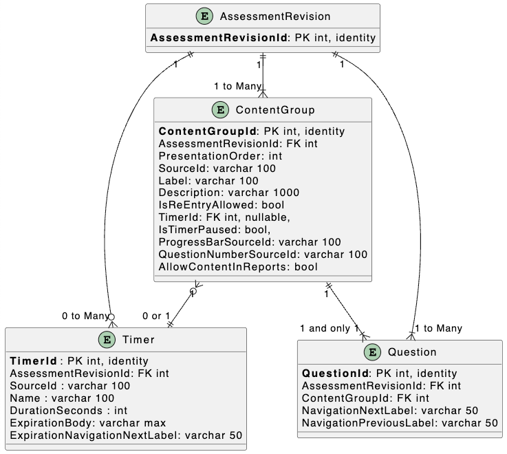
   - **Table of Field Descriptions for each entity**
      *List and describe every field of every entity and the data type. Include data type sizes you are using SQL (for example, nvarchar 50 is a 50 character Unicode string in SQL Server.) Note whether the field is required or nullable (can be empty). If the field is a key, note if it is a primary or foreign key. If the key is a foreign key, note the origin table of the value. Below is an example (note it does not describe every field, so do not copy this example)*
      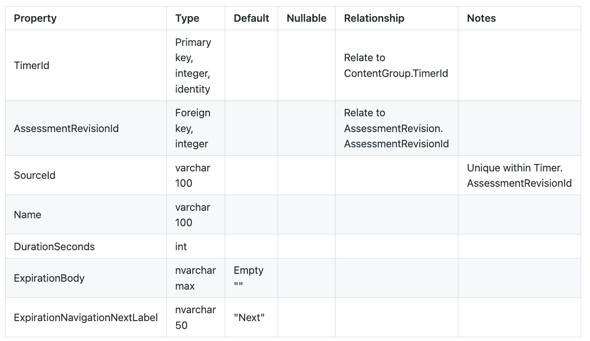
   - **Example Data**
      *For each entity in your entity relationship diagram, create a table showing 3-5 sample records. Make sure they follow your data types described in the Table of Field Descriptions and are properly related to one another if there are foreign keys to other entities. Your goal here is to ensure a developer reading your entity design plan can see realistic examples of the types of data and how they related to one another.*
      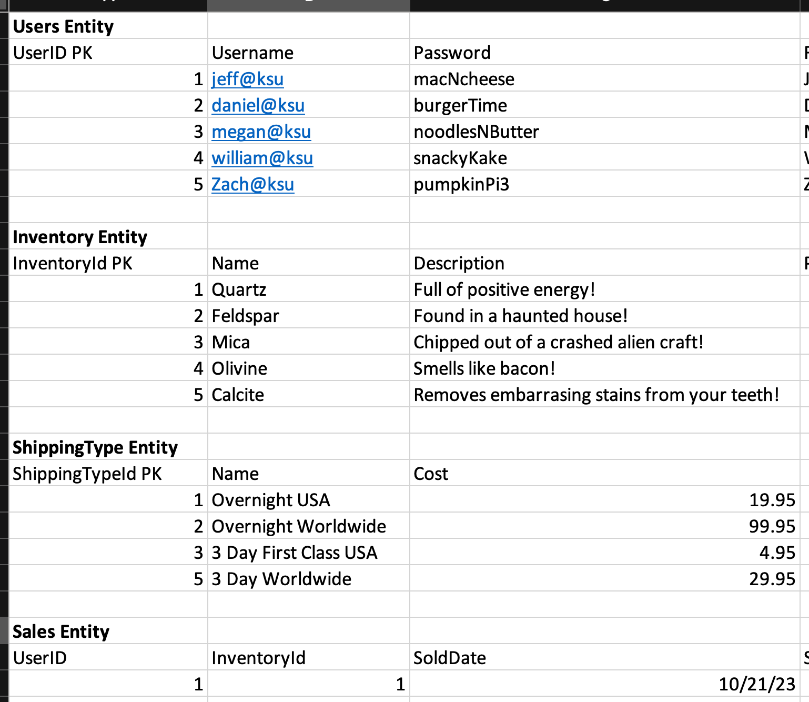

- **Database Seed Data**<br/>
   When you start your application, what is *already* in the system? [We call this "seed data"](https://en.wikipedia.org/wiki/Database_seeding). Typically that includes at least one administrator account, your inventory items and photos, etc. This is *not* the same as example data. This is actual data your application requires to simply start the first time and will be present in your implementation.
   *Create a table describing your seed data for each entity that will contain data when the application starts.*
   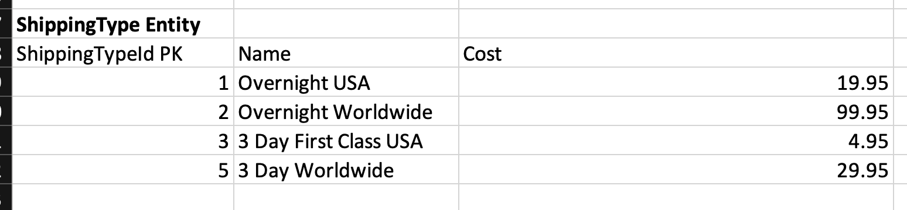

- **Data Storage Plan**<br/>
   How will your application store data? Your choices are CSV (not recommended!), JSON, and SQL. Describe the libraries and technologies you will use to store data. For example, if you are using C#, you might use Dapper or Entity Framework for data access to write to an embedded SQLite database. If you are using Java, you might use a JDBC driver to access your SQLite database. Write this as a series of steps or bullet points. Avoid large long dull paragraphs.
   *Remember that the data you change/add **must remain available the next time you start the application** - this is a class project, but it needs to operate like a real application - starting fresh every time you launch the application is not realistic. Therefore, you must have persistent data storage - not just memory storage. As always, write using bullets, lists, and tables... avoid huge paragraphs.*

- [**Coding Style Guide**](https://www.cs.cornell.edu/courses/JavaAndDS/JavaStyle.html)<br/>
   *Here you will link to your language's coding style guide, plus add any coding style instructions you expect all developers to follow. A common feature of a coding style guide is source control management, such as use of git and perhaps a branch management strategy such as [GitFlow](https://www.atlassian.com/git/tutorials/comparing-workflows/gitflow-workflow#:~:text=What%20is%20Gitflow%3F,lived%20branches%20and%20larger%20commits.) The ultimate goal is that all code follows a consistent style and appears to have been written by one person. Think about what will help future developers will need to understand your system, including commenting guidelines, naming conventions, filename conventions, etc. As always, write using bullets, lists, and tables... avoid huge paragraphs. Here are some good examples:*

   - https://www.pullrequest.com/blog/create-a-programming-style-guide/
   - https://google.github.io/styleguide/
   - https://syllabus.codeyourfuture.io/guides/code-style-guide
   - https://www.cs.cornell.edu/courses/JavaAndDS/JavaStyle.html
   - https://learn.microsoft.com/en-us/dotnet/csharp/fundamentals/coding-style/coding-conventions
   - https://blog.codacy.com/3-popular-csharp-style-guides

   *Here is a tiny fragment of a similar example I recently added to a project design.*
   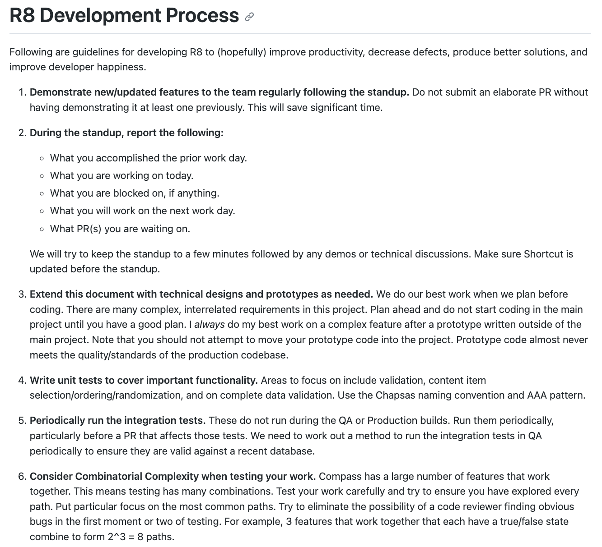

   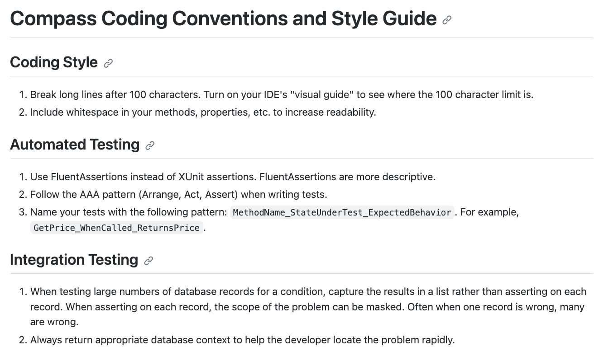

### Your Technical Design Audience is another Engineer

The audience for your Technical Design is a software engineer - not your client (me). For the purpose of this project, assume that the software engineer is an outsourced engineer that speaks English, but is in another country and timezone. Also assume that remote developer is me (surprise!). Therefore, your Technical Design must answer a lot of questions effectively and with high precision to avoid midnight phone calls and long meetings answering questions that should have been covered in your Technical Design. Ask yourself if your outsourced developer can execute your design based on what you have written? If not, then you need to revise your Technical Design. 

After your Technical Design is complete and posted to your team GitHub repo, you will produce yet another 5 minute video presentation going over the Technical Design. In this case, your audience is your remote developer (who happens to be me). Therefore, you need to introduce the material, call out what is important, describe areas of high risk, etc. Remember that the developer can read, so just reading the document to the developer is a waste of time... give the developer some perspective and try to focus on high priority features and high risk areas of concern.

As always, your work will be written in Markdown and posted to your team project in your shared GitHub repo. Your work must be well-organized, linked off your main README.md file, professionally produced, accurate, and exhibit excellent grammar and spelling.

### Instructions and Grading Rubric

[Technical Design Instructions and Grading Rubric](details-technical-design.md)

## Implementation

`35% = 105 of 300 points`

`Due Mon April 28`

Finally, you are ready to produce your application! You have planned most of the semester and you know exactly what to make.

Now you will execute the requirements by implementing your User Interface Design and Technical Design. Your goal is to make your implementation look as close to the User Interface Design as possible.

You will submit your implementation to your client (me) via Github. It will include:

- well-written code that follows your language's style guide. Do not use Java conventions in a Python app.
- a README.md in the source that includes:
   - a brief description of your application (from an end-user point of view),
   - environment requirements, such as "MacOS or Linux or Windows" (be very specific the systems and operating systems where you application can run),
   - steps to clone and build the application on a fresh machine. Be very specific - I will be attempting to follow these steps on my machin. You must describe all of the steps, dependencies, gotchas, database schema scripts, warnings, etc. I need to get your application working without a lot of fuss. If I cannot make your application work, your grade will suffer. Be very thorough on this part and have every person on your team test the steps to ensure everyone agrees it is complete.
   - any other important information you need to pass along to someone trying to setup and run your application.

There are many good articles on writing an excellent read.me. [I recommend reviewing a few so you do a great job producing this very important document.](https://bulldogjob.com/readme/how-to-write-a-good-readme-for-your-github-project)

I cannot stress how important is that your code compiles and runs. The whole point of software is to solve a problem. Code that does not compile cannot begin to solve a problem. Make sure your system runs, even if it does not meet every requirement or the UI looks awful. All of the work you have done till now was the *necessary journey* to refine your thoughts to the point you could produce a great application, but NONE OF IT MATTERS if the application does not run. Ultimately our work is about working software that solves a problem... your end user almost certainly does not care how fantastic your requirements and planning and designs were if the solution does not work.

Pro Tip: I recommend that every team member review your implementation's readme.md file and try to configure your implementation in a fresh directory. This will help you see steps you have overlooked. I think great work makes it easy on the end-user to get started quickly without having endlessly Google and troubleshoot to try out your work.

### Optional Setup Presentation

If you are concerned I will have trouble running your application on my machine, create a 3-5 minute presentation showing exactly how to set it up and run it. If you are confident I am going to have no problem following your directions, you do not need to produce this video. If you produce this video, it does *not* replace your final presentation video and it does not confer any extra credit. It is simply to ensure I can get your application operational.

### JetBrains Professional IDEs

I recommend that you get a JetBrains education license and try their products. These are professional-grade cross-platform IDEs that work with almost every popular language.

Many developers go to great lengths to get VS Code or BB Edit or Textmate or "insert name of free thing here" to do what they need and that is fine, but you should also learn whether the productivity tools from companies like JetBrains will make your work go faster, find bugs faster, and produce better code.

NOTE: I like JetBrains IDES because they have a wide breadth of cross-platform offerings for all popular languages and they all work similarly so your Linux work in Java more easily translates to expertise working in Windows with Python. This is one of my favorite features of their product line since it lets me focus on the problem rather than "how do I compile and debug in [thing here]."

PRO TIP: I routinely ask people I am considering hiring "what tools do you like to use?" You can learn a lot about an engineer by the tools they select. The best tools, no matter who makes them, make you faster and help you produce better work. I routinely see people who will select an important tool simply because it is free, rather than perhaps paying $100 for an outstanding tool that will make them more productive and produce better work in less time. Open source/free is great, but sometimes you get more from a licensed product. Great engineers often buy their own tools, their own keyboards and mice, etc. if the company they work at does not provide great tools (also note that the best companies provide great tools and work environments). It's stupid to pay someone $100,000 and get cheap over a tool that makes that expensive employee far more productive.

PRO TIP 2: I will not hire an experienced engineer who says they do not care what tools they use. To me, that shows a lack of craftsmanship and passion for your art. Further, I will escort you out of the building and push you into the street if you say you use Windows Notepad to write your code. Windows Notepad sucks.

PRO TIP 3: You would not hire a carpenter who has no tools. Sometimes, you have to pay for good tools. For whatever reason, some software engineers will not usething that is not free. That's workable but not always pragmatic. Licensed software, particularly when reasonably priced, is an outstanding investment. Note that Visual Studio is not reasonably priced IMO, which is why I recommend trying JetBrains Rider if you are doing C# development.

### Instructions and Grading Rubric

[Implementation Instructions and Grading Rubric](details-implementation.md)

-----

## Final Presentation

`20% = 60 of 300 points`

`Due Mon April 28`

This is the end. You are done! The holidays are almost here and this course has an OPTIONAL final exam!

Once your implementation is ready, you will produce a polished 5 minute presentation of your working application. Your audience is your client (me). Assume that your client (me) brought 40 members of his team (all of you) with him to view the final presentation.

This is where you get to shine. Many final presentations just stagger me. By now you will know how to make a great presentation for the target audience.

Your 5 minute final presentation will include:

1) A run through of your application that demonstrates every screen and logging on as both a user and an administrator.
2) A comparison of your final application's user interface and your Marvel UI design. Explain why or why not your implementation met your design and what you learned from that. In real life, when your mockup does not match your final implementation, your client may be upset... it's like an architect designing a soaring skyscraper and the builder delivers a large tent. If your final work does not match your design, own it and learn from it. 
3) Anything awesome you want to show off.

After the entire class views your final presentation, your client (me) will ask you some questions. Your team must be present - everyone must participate.

We will use two lecture periods for final presentations. Each presentation and Q&A session will take about 10-12 minutes. Attendance is mandatory for all students for both presentation days.

Presentation order will be randomly selected (except late teams, which must present on Dec 5).

- Presentations 1-5 on Thurs Nov 30
- Presentations 6-10 on Tues Dec 5

### Instructions and Grading Rubric

[Final Presentation Instructions and Grading Rubric](details-final-presentation.md)

-----

## Peer Evaluation

`10% = 30 of 300 points`

`DO NOT POST IN GITHUB - Post in D2L Folder`

Hopefully you have an outstanding team experience during this project. If not, hopefully you learned something about how challenging working in a team can be and how important it is to have the right people on the team with you.

In this component, you will rate each of your teammates *and yourself* between 0 and 30 points. You are welcome to give everyone a top score including yourself. Or you can award less. 

Each student will receive the average of what was awarded by their teammates and themselves. For example, if you get a 30, 30, 10, 30 from yourself and your 3 teammates, your Peer Evaluation score will be (100 / 120) * 30 = 25 points`, or 83.3%.

You do not have to provide a reason for your scores and I certainly will not pass a reason along if you do give me one. Scores are therefore anonymous in that regard.

If you get less than top scores from your teammates, please ask yourself what you could have done to contribute more, to better support the project and your teammates.

Here is some guidance you might consider:

- Do not penalize someone's score with whom you did not communicate your concerns with already. Have the courage to speak up when a problem occurs, not far after the fact. We are all here to learn, so make problems in the team a learning experience rather than a punishment at the end of the semester. There is an old adage that anyone you fire should already know it's coming because you already communicated your expectations.
- Everyone is here to learn, so perhaps pull back your penalty if you saw growth over the semester. Sometimes teammates who start out poorly end up learning what they need to do to support the team. This is growth.

Generally the only students who get poor scores from their teammates were the students who simply did not participate or let the team down in a big way during some critical piece.

So be a great team member and step up to the project. If you are not a great coder, help the great coder in the group test. If you are not a great writer, proofread the requirements. If you are the leader, do not be an a-hole, work on your diplomacy, and learn a bit about [Servant Leadership](https://www.forbes.com/sites/forbescoachescouncil/2020/03/11/traditional-leadership-vs-servant-leadership/?sh=493498c6451e). This project covers many disciplines, so everyone has a chance to be a great contributor for some piece of it.

### Instructions and Grading Rubric

[Peer Evaluation Instructions and Grading Rubric](details-peer-evaluation.md)
