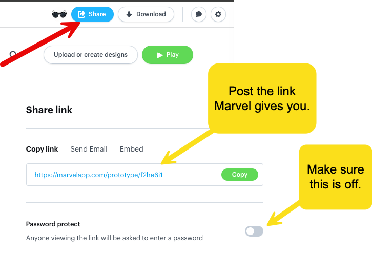

[< Back to Project Overview](README.md#user-interface-design)

# User Interface Design Instructions and Rubric

In this component, you are designing how users will move through your application. After reviewing your mockup, your client (me) will have a good understanding how each screen will look and how each screen relates to one another.

In reality, it is unlikely a real client/stakeholder will completely read and understand your requirements. It is easier for most stakeholders to map their expectations onto the visual controls of a software solution than to imagine how it all fits together reading tables of requirements. Thus, we do User Interface Design to help our stakeholder envision the final project. During this part of a project, it's common for clients to say "OMG, I didn't think about that" or "This reminds me... I forgot to tell you" or "The colors you picked do not match our brand" or "This does not match my expectation" or "You can do this operation in 2 steps rather than 3 if you..."

## Requirements

Your UI design and high fidelity mockup will demonstrate *every **must-have*** screen in your future implementation, including:

- Login including a link to self-register
- Self-Registration (creating your Customer account)
- Inventory List including Search
   - Mockup the inventory list without a search active
   - Mockup the inventory list filtered by a search term limiting the results to matches

- Shopping Cart including Remove Item(s)
- Checkout including payment acceptance and on-screen receipt
- Sales Report (Administrators only)

**Here are your deliverables in this phase:**

1.  A well-designed hot linked user interface prototype covering every must-have user interface built using [Marvel](https://marvelapp.com). Make sure you [carefully review all of the user interface design notes]((README.md#user-interface-design)) in the main project document. Focus on great usability. Ask your friends and family to try it out, then watch them as they move through your application prototype (this can be very painful, but very instructive). Your work must use Marvel. Do not submit designs made in PowerPoint, hand-drawn, or another design tool.
2.  A 3-5 minute [Presentation](README.md#requirements-presentation) giving a high level review of the user interface prototype to your customer. Do not just read the screens! Explain why screen A goes to screen B, color choices, how your design was influenced by the technology you are using for implementation, etc. Remember that you are setting the customer's expectation for how the final application will look. Make sure your customer understands how they will move through the application. Check your video presentation into your team Github repo. You can also post a YouTube or Vimeo link if you wish.

Post links to your two deliverables to your team's shared Github repo. Your links must be easy to find and well-integrated with the prior work your team has already done.

-  Public link to your Marvel user interface prototype. Verify you can use  the public link without a user account by logging out of Marvel, then trying the link. If you cannot access the link without a team account, then I cannot either.
   
-  Link to your video presentation (shared in GitHub or a public YouTube or Vimeo link).

### Submission Steps

The entire team will work execute the user interface design EFFORT. *All of you need* to review the completed work. This is a team effort and the team will succeed or fail as a group.

User interface design is critical to the success of your project. Be very careful here and strive for accuracy and outstanding communication technique.

Once your work is complete, add a section called User Interface Design to your project's main README.md file that links to your Marvel project.

### Grading Rubric

#### Component Percentages

1.  Marvel user interface prototype - 80%
2.  3-5 minute video presentation describing your user interface design - 20%

#### User Interface Design Scoring

-  90 to 100%: implements all must have user interfaces, is properly hot linked to flow through the application, demonstrates good usability, and is highly professional. Polished work gets the top grade.
-  80% to 89%: implements all must have user interfaces, is properly hot linked to flow through the application, may have some usability issues.
-  70% to 79%: implements at least 6 of the must have user interfaces, is properly hot linked to flow through the application, may have some usability issues. 
-  69% or below: does not implement at least 6 of the must have user interfaces or is very poorly designed. Likely has very serious usability issues.

*Note: Your application user interface design must be linked from your team GitHub repo to be graded. Marvel links submitted directly through D2L or via email will not be graded.*

#### Presentation Scoring (20% total)

*Do not just read requirements!*

-  90% to 100%: meets all requirements, well-organized, easy to follow audio. Polished work gets the top grade.
-  80% to 89%: meets all requirements, easy to follow audio, may have some organization issues.
-  70% to 79%: meets most requirements, may have some organization or audio issues.
-  69% or below: does not meet most requirements or has little or no audio.

*Note: Presentations not posted to Github will not be graded.*

### Academic Honesty

Your work must be your own. Do not plagiarize under any circumstances. All work is subject to review by TurnItIn, etc.

More importantly, this course is a waste of your time if you do not do the work yourself. If you are tempted to cheat, you need to ask yourself why you are here and what you hope to accomplish in your career if you get the grade, but have minimal ability to perform the work after you leave the University.

### Team Grading

Everyone on the team will receive the same grade one exception. It follows.

Anyone not participating in the project may be removed from the team and have to perform the project alone. Before anyone can be "fired" from a team, I must meet with the *entire team* and hear what is happening. Do not fire anyone from your team without my explicit prior agreement.

---

[< Back to Project Overview](README.md#user-interface-design)

